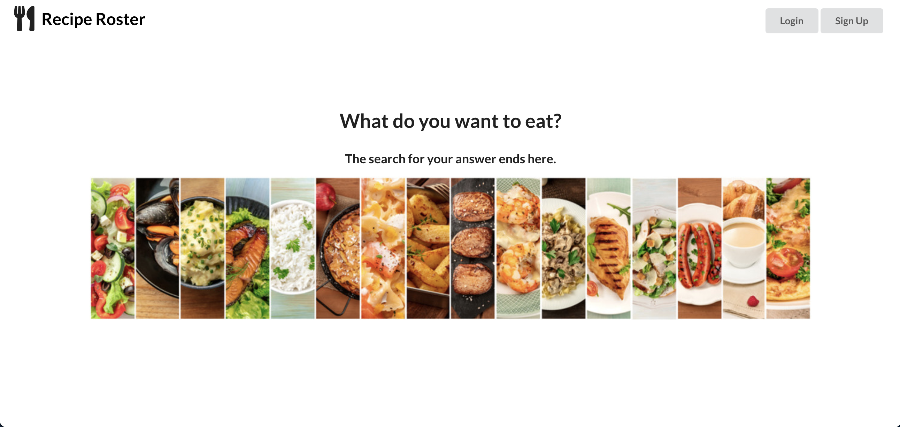
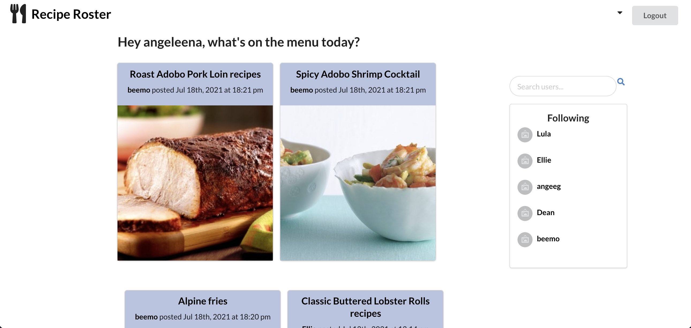
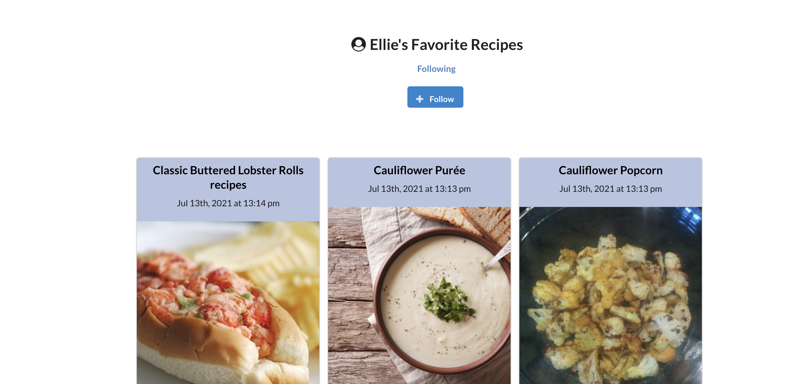
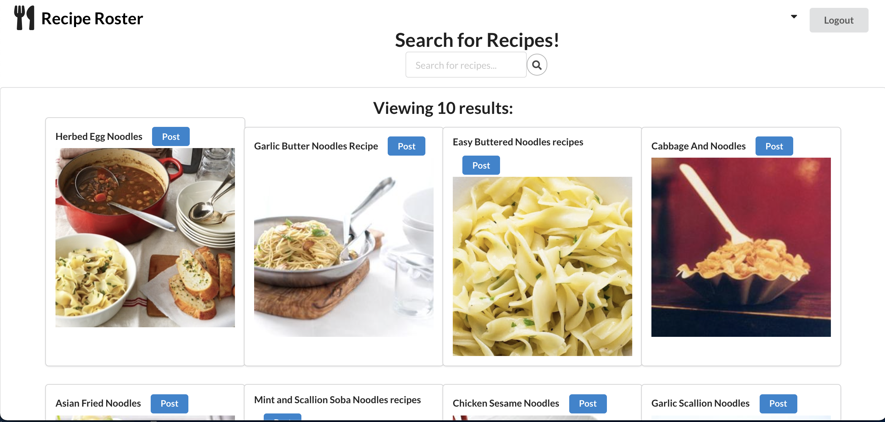
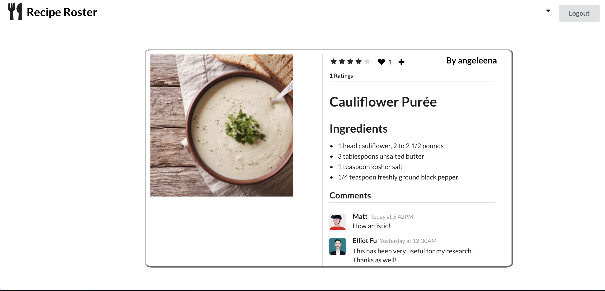

# recipe-roster

## Table of Contents
* [Description](#description)
* [Installation](#installation)
* [Usage](#usage)
* [Credit](#credit)
* [Contribute](#contribute)
* [Test](#test)
* [License](#license)
## Description 
Do you love cooking but don't know what to eat? Or maybe you're not the most passionate about cooking, but just need a recipe to make for dinner. Whatever the case may be, you need to eat. Recipe Roster was created to help you find that perfect dish. A mash between pintrest and goodreads... for food - Recipe Roster is somewhere you can lookup recipes, post them to your profile, and share them with your friends/followers. You can follow other users to see what recipes they are trying, and even add comments and rating to their recipe posts to help decide what would be worth cooking. Follow the link below or follow our installation instructions to begin your recipe search today!

## Installation 
1. Clone the <a href="https://github.com/campbefs/recipe-roster.git">github repo</a> onto your machine in the directory you want to save it in. 
2. Open the repo in your code editor. 
3. Open the terminal in your code editor and run 'npm i' then run 'npm run develop' to invoke the application.
## Usage 
This app is intended to be used to search recipes and share your experiences, with those recipes, with other users. 

### Technologies Used:
* GraphQL
* Apollo Server
* React/JSX
* Semantic-UI-React 

## Credit
This project was made possible thanks to:
* <a href="">Chris Campbell</a> - scrum master, backend developer 
* <a href="">Devin Pask</a> - frontend developer
* <a href="">Angeleena Syse</a> - frontend developer 

## Contribute 
If you wish to contribute to this application please send a pull request. 

## Questions
If you have any questions please contact any of the creators above.
